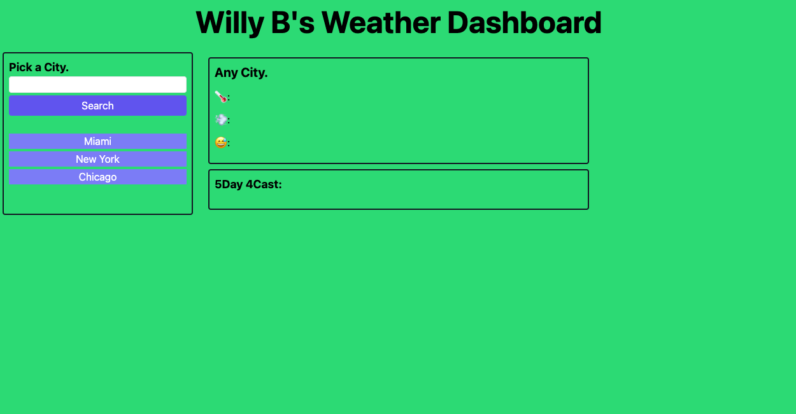

# Willy B's Weather Dashboard

This was my first challenge using Server-Side APIs.

With one link to account for two distinct URLs (the primary difference being "weather" vs. "forecast" before ${cityLogged}), I came to the realization that creating one searchCity function, as opposed to two, would help me reflect the fact that both URLs are helping retrieve data from the same city.

Ultimately, I was able to expand my knowledge of functions, most notably the use of inner HTML, Tailwinds, init functions and unshift vs. push to name JUST a few.

As specified in the Challenge Acceptance Criteria, the dashboard achieves the following:

✨ After clicking "Search", current and future conditions for that city appear and that city is added to the Picked Cities.

✨ For current conditions, the city name, the date, an icon representing weather conditions, the temperature, the wind speed and the humidity appear.

✨ For the five-day forecast, the date, an icon representing weather conditions, the temperature, the wind speed and the humidity appear.

✨ Upon clicking one of the Picked Cities, current and future conditions for that city appear.

Below is a screenshot of my latest and greatest:

Next time you're wondering what to pack for your next trip, visit https://willbrennana.github.io/06_weather-dashboard/
